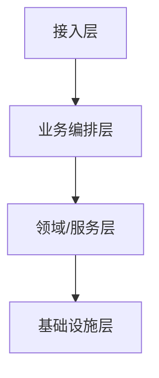
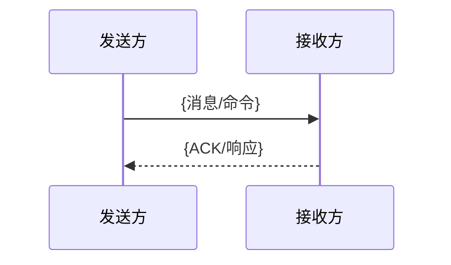

# 页面形状（Page Shapes）

各 `type` 的页面骨架。所有页面的 frontmatter 一律遵循 [frontmatter-schema.md](frontmatter-schema.md)，下面只示意正文结构。

通用写作规则见 SKILL.md：中文 prose、保留代码标识符原文、结论先行（前三行说清这页为何重要）、一页一主题。

---

## use-case（用例视图入口，编排 + 链接为主）

```markdown
# 用例：服务开通
> 目标 / actor / 触发方式（一句话讲清这个场景是什么）

## 前置条件
{触发前需满足的业务状态}

## 端到端编排
1. [[repos/order-service/flows/下单]] —（经 [[contracts/CreateOrder]]，跨仓）→
2. [[repos/resource-service/flows/资源分配]] →
3. [[repos/billing-service/flows/计费开通]]

## 涉及业务域
[[domains/订单域]] · [[domains/资源域]] · [[domains/计费域]]

## 关键判定点 / 验收
{决定成败的分叉与验收标准}

## 风险链
[[repos/{repo}/runtime-notes#资源预占一致性]]
```

不复述 flow 内部。单 flow 场景不开此页（见 [view-model.md](view-model.md) 防呆规则）。

---

## domain（逻辑视图，概念字典）

```markdown
# 业务域：订单域
> 这个域负责什么、边界在哪、与哪些域相邻

## 核心概念
- {概念}：定义、不变量

## 实体与状态
- {实体}：状态集合、状态机定义

## 相邻域
[[domains/资源域]] — {关系}

## 实现该域的流程
[[repos/order-service/flows/下单]]
```

---

## contract（契约视图，定义一次、被多 flow 引用）

```markdown
# 契约：CreateServiceOrder
> 边界种类 / 消息标识 / producer → consumer（一句话）

## 消息/接口标识
{协议名、message ID、TLV type、command ID、operation code、topic、route、method、event name}

## Payload Schema
| 字段 | 类型 | 必填 | 取值范围 | 含义 |
|---|---|---|---|---|

## Producer
[[repos/resource-service/modules/...]] — {发送场景}

## Consumer
[[repos/order-service/modules/...]] — {消费场景}

## 接收方发现证据
{注册表 / 路由表 / topic 订阅 / message-code switch / decoder / handler 绑定 / 命名约定}

## 使用该契约的流程
[[repos/order-service/flows/下单#跨边界]]
```

> 契约页持有**可复用的定义**（schema、标识、producer/consumer）。flow 里的跨边界内容只持有**本场景如何用**，链接回此页，不重抄 schema。

---

## module（实现视图，多实例）

```markdown
# 模块：订单编排
> 职责一句话 / public entry / 它依赖谁、谁依赖它

## 职责
## 公共接口
## 依赖（出）
[[repos/resource-service/modules/资源分配]]
## 被依赖（入·反向链接）
[[repos/api-gateway/modules/路由]]
## 相关流程
[[repos/order-service/flows/下单]]
```

---

## architecture（仓库实现视图 + 路由，含架构图）

````markdown
# {repo} 架构
> 技术栈 / 分层 / 最重要的入口（前三行让 agent 抓住全貌）

## 架构图


## 分层与职责
{每层职责一句话}

## 核心模块（仓库路由）
[[repos/{repo}/modules/订单编排]] · [[repos/{repo}/modules/资源分配]]

## 关键流程入口
[[repos/{repo}/flows/服务开通]]（已深挖）· 候选见 [[repos/{repo}/candidate-flow]]

## 对外契约 / 数据
[[repos/{repo}/api-surface]] · [[repos/{repo}/data-models]]

## 设计模式
{从代码识别的真实模式}
````

工作区 `architecture/system-architecture.md` 同理，含一张**跨仓** mermaid 架构图。

---

## candidate-flow（次关键流程候选清单，运行视图）

```markdown
# {repo} 候选深挖流程
> 次关键流程清单，等用户确认是否 deep-analysis（关键流程已直接深挖）

## Deep Analysis 候选流程清单
| 序号 | 流程名称 | 入口/接口 | 触发方式 | 涉及仓库/模块 | 是否跨消息边界 | 风险等级 | 推荐原因 | 状态 |
|---|---|---|---|---|---|---|---|---|
| 1 | {流程名称} | `{文件路径}:{函数}` | HTTP/RPC/MQ/TLV/job/CLI | {repo/module} | 是/否 | high/medium/low | {证据与业务原因} | 候选 |
```

确认深挖后，对应行 `状态` → `已深挖`，并在 `flows/{分析主题}/` 生成深流程文件夹。

---

## 深流程文件夹（obsidian-kb-deep-analysis 产物）

`repos/{repo}/flows/{分析主题}/`，六个文件。**已按"定义一次、引用多次"瘦身**：

### 调用树.md — 结构索引
逐节点调用树（函数 / 文件路径 / 一句话职责 / 分支数 / 外部调用 / 边界标记 / 链到 Phase 2 分支页）。不可用 `...`/"等"跳过节点。

### 主干流程.md — 默认路径散文
每步：函数签名+路径、入参出参、伪代码级逻辑、读写的数据结构、状态变更、跨边界主干追踪（链 `[[contracts/X]]` + 接收方入口）、分支标记。

### {分支主题}.md — 分支逐个展开（仅够分量的分支才建此文件；简单分支就地写在主干）
精确条件表达式、完整逻辑链、合并点、嵌套分支。必含双链:`[[调用树]]` 节点 + `[[主干流程#Step]]` 来源 + 父/子分支。

### 跨边界数据流.md —（瘦身）本流程的边界用法，**不重抄契约定义**
````markdown
# 跨边界数据流：{分析主题}
> 本流程穿越了哪些边界（列表，每个链到 contracts/）

## 边界一：[[contracts/CreateServiceOrder]]
### 发送方处理
触发函数+文件 / 业务前置 / 字段来源推导 / payload 构造 / 编码 / 发送调用 / 发送前后状态 / 错误·重试·超时
### 接收方处理
接收入口+文件 / 解码·分发 / handler / 校验 / 字段消费 / 状态变更·副作用 / 响应·ACK / 回调·后续消息
### 字段映射
| 发送方字段 | 取值来源 | → 接收方字段 | 接收方消费 |
|---|---|---|---|

payload schema 见 [[contracts/CreateServiceOrder]]（不在此重抄）

## 端到端时序图

````
可复用的 schema / 消息标识 / producer-consumer 一律提升到 `contracts/{X}.md`，此页只留场景特定收发行为 + 时序图。
**发送方处理与接收方处理两节都必须填**，不得只写一方（与 obsidian-kb-deep-analysis Phase 3 / Phase 5 自查一致）。

### 数据结构.md —（瘦身）本流程的结构生命周期，**完整定义在 data-models**
```markdown
# 数据结构：{分析主题}
## {结构名}（完整字段定义见 [[repos/{repo}/data-models#{结构名}]]）
- 在本流程的生命周期:谁构造 → 谁传递 → 谁消费 → 谁销毁
- 在本流程被读/改的字段及含义
```
完整字段定义提升到 `repos/{repo}/data-models.md`，此页只留本流程的使用/生命周期。

### 自查报告.md — 覆盖度与链接闭环
见 obsidian-kb-deep-analysis 的 Phase 5 检查项。

---

## 工作区人工叙事页（system-architecture）

汇总 + 链接为主，**不持有详细流程追踪**。增量时不重写，受影响则打 `status: stale`。
`system-architecture.md` 是工作区**唯一**的人工叙事总览，含一张**跨仓** mermaid 架构图（服务/仓库间关系），其余靠链接指向各 repo `architecture.md`。

依赖图 / 技术栈 / 数据流 / 影响面**不物化成页**——由 query 从 `depends-on` + 反向双链即时遍历得出。
