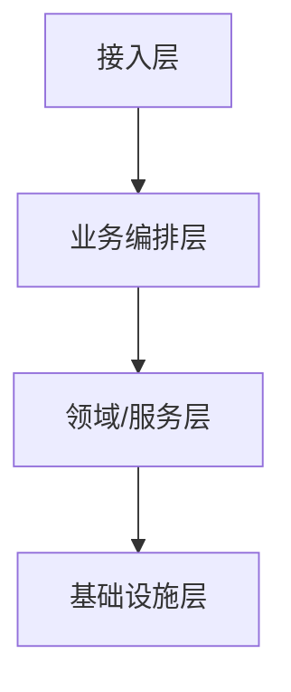

# {{title}}
> <!-- 填:技术栈 / 分层 / 最重要的入口,前三行让 agent 抓住全貌 -->

## 架构图

<!-- 填:按真实分层改写上面的 mermaid;工作区 system-architecture 画跨仓关系图 -->

## 分层与职责
<!-- 填:每层职责一句话 -->

## 核心模块（仓库路由）
<!-- 填:[[repos/{repo}/modules/X]] · [[repos/{repo}/modules/Y]] -->

## 关键流程入口
<!-- 填:[[repos/{repo}/flows/{主题}]]（已深挖）· 候选见 [[repos/{repo}/candidate-flow]] -->

## 对外契约 / 数据
<!-- 填:[[repos/{repo}/api-surface]] · [[repos/{repo}/data-models]] -->

## 设计模式
<!-- 填:从代码识别的真实模式 -->
