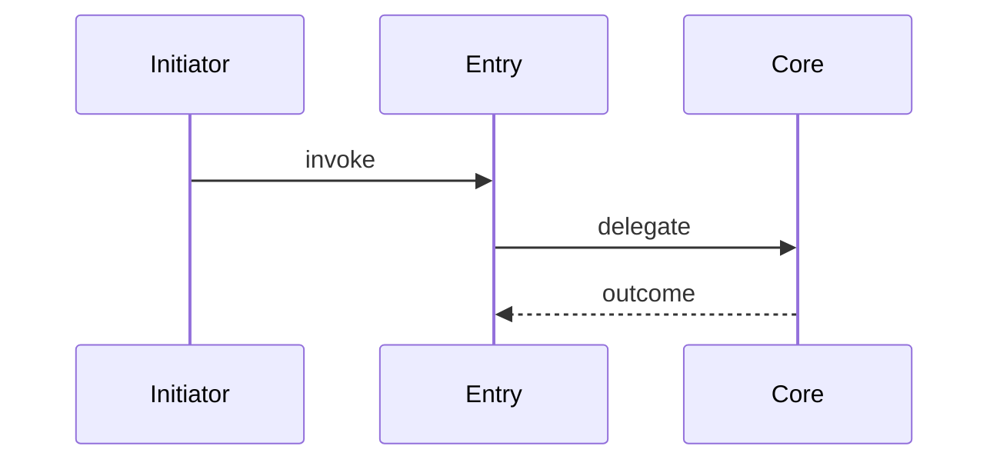

# 主干流程：{{title}}
> <!-- 填:默认路径结论:入口是什么、主要经过哪些组件、产出/副作用是什么。链回 [[调用树]] -->

## 快速导航
| 项 | 链接 |
|---|---|
| 调用结构 | [[调用树]] |
| 分支细节 | <!-- 填:[[分支主题#X]];无则写"无独立分支" --> |
| 跨边界 | <!-- 填:[[跨边界数据流]] / [[global/contracts/X]];无则写"无跨边界" --> |
| 数据结构 | [[数据结构]] |

## 主干时序

## 主干步骤
<!-- 填:每步 = 函数签名+路径 / 输入输出 / 伪代码级逻辑 / 读写的数据项 / 可观察影响 / 跨边界追踪（链 [[global/contracts/X]] + 对端入口）/ 分支标记 -->
| Step | 调用点 | 输入/输出 | 关键逻辑 | 数据读写 | 可观察影响 | 跳转 |
|---|---|---|---|---|---|---|
| 1 | <!-- 填:`funcA` (path/a.cpp) --> | <!-- 填:输入/输出 --> | <!-- 填:伪代码级逻辑 --> | <!-- 填:[[数据结构#X]] --> | <!-- 填:返回值/状态/外部调用/资源变化 --> | <!-- 填:[[分支主题#X]] / [[跨边界数据流#X]] --> |

## 异常与提前返回
| 条件 | 检测位置 | 行为 | 影响 | 链接 |
|---|---|---|---|---|
| <!-- 填:错误条件/空值/边界条件/超时 --> | <!-- 填:path:func() --> | <!-- 填:return/throw/retry/fallback/ignore --> | <!-- 填:返回值/状态/副作用/后续步骤 --> | <!-- 填:[[分支主题#X]] 或无 --> |

## 外部可观察影响
<!-- 填:按本流程真实发生的影响列出,没有的不要硬填。每项给证据、触发位置、失败/重复执行语义
- 输出/返回:
- 状态或存储变化:
- 跨组件调用:
- 资源或调度变化:
-->
