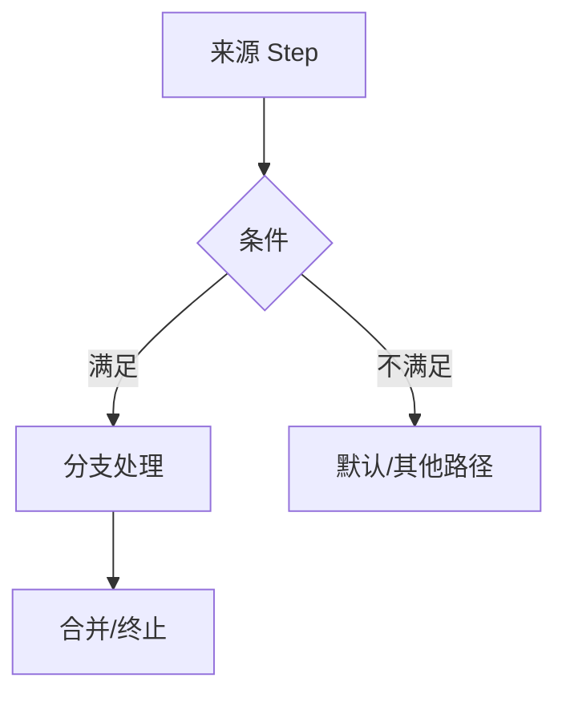

# 分支：{{title}}
> <!-- 填:够分量才单独成页;简单分支就地写进主干。必含双链:[[调用树]] 节点 + [[主干流程#Step]] 来源 + 父/子分支 -->

## 分支总览
| 来源 | 条件 | 结果 | 后续位置 |
|---|---|---|---|
| <!-- 填:[[主干流程#Step-N]] / [[调用树#节点]] --> | <!-- 填:条件表达式 --> | <!-- 填:副作用/返回/异常 --> | <!-- 填:合并点或终止 --> |

## 分支图

## 触发条件
<!-- 填:精确条件表达式 + 变量来源 + 判断位置 path:func() -->

## 逻辑链
<!-- 填:完整逻辑链、合并点、嵌套分支。每步写 path:func()、数据读写、可观察影响、返回值 -->

## 影响与风险
| 分支 | 影响对象 | 风险 | 证据 |
|---|---|---|---|
| <!-- 填:分支名 --> | <!-- 填:[[数据结构#X]] / [[global/contracts/X]] / 状态/输出/资源 --> | <!-- 填:遗漏、重复、顺序、边界条件、资源等 --> | <!-- 填:path:func() --> |
