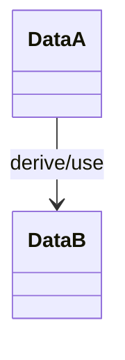

# 数据结构：{{title}}
> <!-- 填:本流程涉及结构的生命周期;完整字段定义在 [[repos/{repo}/data-models]],此页只留本流程的使用/生命周期 -->

## 结构总览
| 结构 | 完整定义 | 在本流程角色 | 生命周期阶段 |
|---|---|---|---|
| <!-- 填:结构名 --> | <!-- 填:[[repos/{repo}/data-models#结构名]] --> | <!-- 填:输入/上下文/中间状态/输出/边界载荷 --> | <!-- 填:创建→填充→传递→读取/修改→结束 --> |

## 生命周期图

## 结构生命周期
<!-- 填:每个结构一段:
### {结构名}（完整字段定义见 [[repos/{repo}/data-models#{结构名}]]）
- 生命周期:谁创建 → 谁填充 → 谁传递 → 谁读取/修改 → 何时结束
- 在本流程被读/改的字段及含义
-->

## 读写矩阵
| 字段/状态 | 写入位置 | 读取位置 | 语义 | 风险 |
|---|---|---|---|---|
| <!-- 填:字段名/状态名 --> | <!-- 填:path:func() --> | <!-- 填:path:func() --> | <!-- 填:含义/取值范围/单位 --> | <!-- 填:为空/并发/顺序/单位/过期等 --> |

## 结构关系

