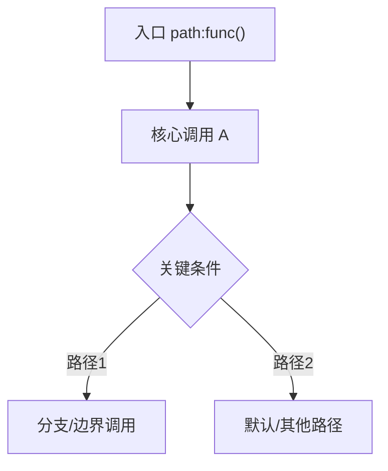

# 调用树：{{title}}
> <!-- 填:本流程的结构索引:入口、关键节点、边界调用、后续阅读路径。不可用 ... 或「等」跳过节点 -->

## 快速定位
| 项 | 内容 |
|---|---|
| 入口 | <!-- 填:`path:func()` + 触发方式 --> |
| 主干页 | [[主干流程]] |
| 关键分支 | <!-- 填:[[分支主题#X]];无则写"无独立分支页" --> |
| 跨边界 | <!-- 填:[[跨边界数据流]] / [[global/contracts/X]];无则写"无跨边界" --> |
| 核心数据 | <!-- 填:[[数据结构#X]] / [[repos/{repo}/data-models#X]] --> |

## 调用图

## 调用树
<!-- 填:逐节点 = 层级 / 函数 / 文件路径 / 一句话职责 / 输入输出 / 分支数 / 边界调用 / 边界标记 / 链到分支页
- L0 `funcA` (path/a.cpp) — 职责 — 入:`X` 出:`Y` — 分支:2 — 边界:{类型} — [[分支主题#条件A]]
-->

## 节点索引
| 节点 | 路径 | 职责 | 证据 | 下游 |
|---|---|---|---|---|
| <!-- 填:`funcA` --> | <!-- 填:path/a.cpp --> | <!-- 填:一句话 --> | <!-- 填:path:func() --> | <!-- 填:[[主干流程#Step-1]] / [[分支主题#X]] --> |

## 边界与外部调用
| 调用点 | 类型 | 目标 | 契约/页面 | 备注 |
|---|---|---|---|---|
| <!-- 填:path:func() --> | <!-- 填:函数/进程/网络/消息/存储/文件/线程/设备/第三方等 --> | <!-- 填:目标组件/资源 --> | <!-- 填:[[global/contracts/X]] 或无 --> | <!-- 填:同步性/失败处理/风险 --> |
