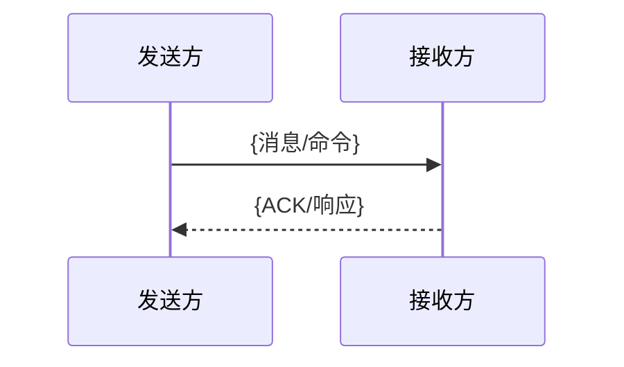

# 跨边界数据流：{{title}}
> <!-- 填:本流程穿越了哪些边界（列表,每个链到 contracts/）;可复用 schema/标识/producer-consumer 一律提升到 contracts/,此页只留场景特定收发行为 + 时序图 -->

## 发送方处理
<!-- 填:触发函数+文件 / 业务前置 / 字段来源推导 / payload 构造 / 编码 / 发送调用 / 发送前后状态 / 错误·重试·超时。两节都必须填,不得只写一方 -->

## 接收方处理
<!-- 填:接收入口+文件 / 解码·分发 / handler / 校验 / 字段消费 / 状态变更·副作用 / 响应·ACK / 回调·后续消息。找不到对端则 confidence:low 并在 coverage 挂账 -->

## 字段映射
| 发送方字段 | 取值来源 | → 接收方字段 | 接收方消费 |
|---|---|---|---|
<!-- 填:逐字段一行;payload schema 见 [[contracts/X]],不在此重抄 -->

## 端到端时序图

