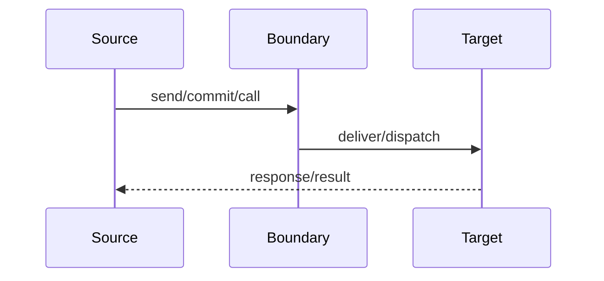

# 跨边界数据流：{{title}}
> <!-- 填:本流程穿越了哪些边界（列表,每个链到 global/contracts/）;可复用 schema/标识/producer-consumer 一律提升到 global/contracts/,此页只留场景特定收发行为 + 时序图 -->

## 边界总览
| 边界 | 发送方 | 接收方 | 契约 | 同步性 | 可靠性语义 |
|---|---|---|---|---|---|
| <!-- 填:进程/API/消息/事件/存储/文件/线程/设备/第三方等 --> | <!-- 填:[[repos/{repo}/...]] / path:func() --> | <!-- 填:repo/submodule/handler/resource --> | <!-- 填:[[global/contracts/X]];无则说明是否需建 partial --> | <!-- 填:同步/异步/批处理/回调 --> | <!-- 填:确认、重试、去重、超时、顺序等 --> |

## 发送方处理
<!-- 填:触发函数+文件 / 前置条件 / 字段来源推导 / 载荷构造 / 编码或转换 / 边界调用 / 调用前后变化 / 错误·重试·超时。两节都必须填,不得只写一方 -->

## 接收方处理
<!-- 填:接收入口+文件 / 解码或转换 / 分发 / handler / 校验 / 字段消费 / 状态或输出变化 / 响应·回调·后续动作。找不到对端则 confidence:low 并在 coverage 记录 -->

## 字段映射
| 发送方字段 | 取值来源 | → 接收方字段 | 接收方消费 |
|---|---|---|---|
<!-- 填:逐字段一行;payload schema 见 [[global/contracts/X]],不在此重抄 -->

## 失败语义
| 失败点 | 检测位置 | 行为 | 重试/补偿 | 影响 |
|---|---|---|---|---|
| <!-- 填:调用失败/转换失败/校验失败/超时/对端拒绝 --> | <!-- 填:path:func() --> | <!-- 填:return/throw/retry/drop/fallback --> | <!-- 填:策略;无则写无 --> | <!-- 填:状态/数据/调用方/下游 --> |

## 端到端时序图

