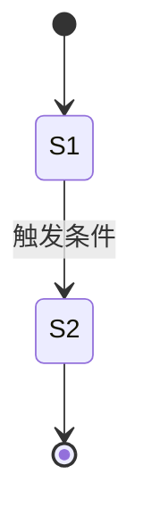

<!-- 外部知识:「迁移优先级与冲突」(并发竞争下的优先级/互斥/终态)大概率非源码可得,需设计文档补充;外部未提供则据已有知识生成。 -->
# 状态迁移规则：{{title}}
> <!-- 填:一句话概括涉及的对象状态机;子模块无对象状态机则删除本文件 -->

## 状态定义
<!-- 填:逐个对象列其状态枚举——
- 对象:哪个对象/资源有状态机,保留源码枚举名
- 状态:全部合法状态 + 一句语义,标出初态与终态 -->

## 状态机图

<!-- 填:按真实状态机改写;节点=状态枚举,边=迁移及触发条件,含初态 [*] 与终态。 -->

## 迁移规则
| 从 | 到 | 触发条件 | 动作/副作用 |
|---|---|---|---|
<!-- 填:每条合法迁移一行——从→到 / 精确触发条件(事件/调用/超时/谓词)/ 动作与副作用(改了哪些数据、发了什么事件);非法迁移若有防御(拒绝/报错)也列一行。 -->

## 迁移优先级与冲突
<!-- 填:并发/多触发下的裁决规则(源码常隐式,据设计文档或加锁逻辑推断)——
- 优先级:同时多个触发时哪条先赢
- 互斥:哪些迁移不能并发,靠什么(锁/CAS/单线程约束)保证
- 终态:进入后不可迁出的状态,以及竞争下的最终一致状态 -->
