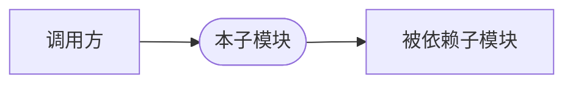

<!-- 外部知识:「业务场景」的业务动机、「安全模型」的信任边界/威胁模型,大概率非源码可得,需外部文档/领域知识补充;外部未提供则据已有知识生成。 -->
# 上下文：{{title}}
> <!-- 填:这个子模块服务于什么业务场景 -->

## 业务场景
<!-- 填:回答三问,每问 1-2 句——
- 服务的场景:哪个上层用例/外部系统触发它,承担其中哪一环
- 解决的问题:缺了它会怎样、为什么值得独立成子模块
- 在整体中的位置:属于哪个 domain/分层,上游给什么输入、下游接什么产出
业务动机源码里没有,外部文档缺失时据代码入口与命名审慎推断。 -->

## 安全模型
<!-- optional:有信任边界才写,无则删本节。逐点说清——
- 认证/鉴权:谁被允许调用、凭据从哪来、在哪一步校验
- 数据保护:密钥/PII/token 等敏感数据如何存取、加密与脱敏
- 信任边界:哪些输入当作不可信、跨边界处做了什么校验/隔离/限流 -->

## 交互关系图

<!-- 填:按真实交互改写;入边=调用本子模块的一方,出边=本子模块依赖的一方;节点名用子模块/仓名,边可标交互方式(调用/事件/共享数据)。只画一跳邻居,不展开全图。 -->

## 与外部模块的交互
<!-- 填:逐条列,每条=对象 + 方向 + 交互方式 + 用途——
- 依赖出:本子模块调用/依赖谁,链 [[repos/{repo}/submodules/{topic}/上下文]],每条与 frontmatter depends-on 一一对应
- 交互方式:直接调用/RPC/消息/共享存储,同步还是异步
- 上游入:主要被谁调用(逐条反向链接归下一节「被依赖」) -->

## 被依赖（入·反向链接）
<!-- 填:谁链向本子模块,每条 [[repos/{repo}/submodules/{topic}/上下文]] 或 [[repos/{repo}/flows/{主题}/主干流程]];此为反向链接,随增量累积,暂无则留空,不编造。 -->
