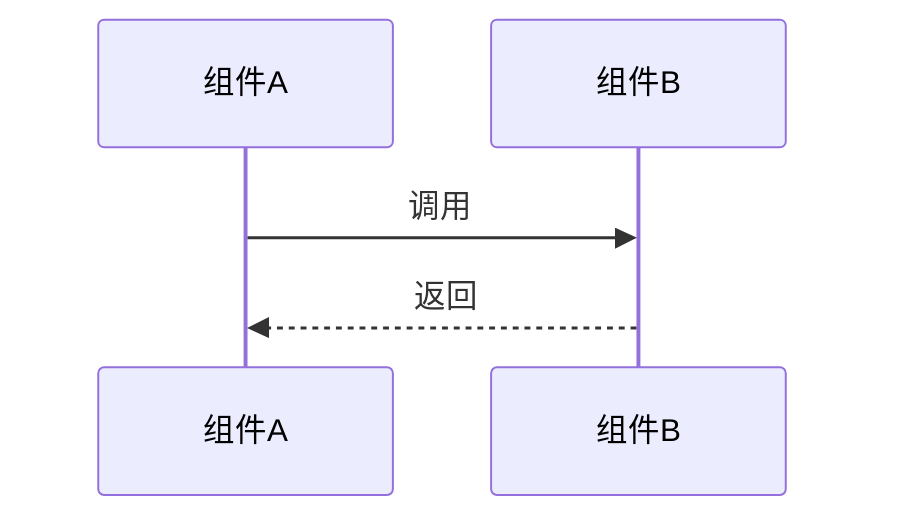

# Obsidian KB Deep Analysis

Use this for detailed function or flow analysis. It is stricter than normal flow documentation.

Always combine with `obsidian-kb-authoring` when writing notes.

## Output Location

Create a dedicated folder:

```text
repos/{repo-name}/flows/{分析主题}/
├── 调用树.md
├── 主干流程.md
├── {分支主题}.md
├── 跨边界数据流.md
├── 数据结构.md
└── 自查报告.md
```

Only edit files outside this folder when adding bidirectional links or updating shared pages such as `repos/{repo-name}/data-models.md`, `repos/{repo-name}/overview.md`, or `log.md`.

## Execution Mode

- Run all phases continuously by default.
- Do not pause for user confirmation between phases unless the user explicitly asks for step-by-step review.
- Each phase must still be saved independently before moving on, so partial results remain inspectable and recoverable.
- Cross-message tracing scans the whole workspace by default. Do not limit downstream handler discovery to the current repository unless the user explicitly restricts scope.

Report progress after each phase:

```text
Phase N 完成，继续 Phase N+1...
```

## Phase 0: 调用树摸底

1. Create `repos/{repo-name}/flows/{分析主题}/`.
2. Start from the specified entry function.
3. Recursively trace called functions.
4. Save `repos/{repo-name}/flows/{分析主题}/调用树.md`.

For each function include:

- Function name/signature.
- File path from repo root.
- One-sentence responsibility.
- Whether it contains conditional branches and how many.
- Whether it performs external calls: RPC, DB, MQ, filesystem, network, subprocess.
- Whether it crosses a protocol, message, event, topic, socket, or TLV boundary.

Tree format:

```text
├── computeRoute() [src/route/compute.go] — 算路总入口，3 条分支
│   ├── loadTopology() [src/topo/loader.go] — 加载拓扑，外部调用：DB
│   └── preprocessResource() [src/resource/prep.go] — 资源预处理
```

Do not use `...`, "等", "类似", or any placeholder to skip nodes. If the tree exceeds 200 nodes, save the first part, continue into a numbered continuation file, and report the split in `自查报告.md`.

## Phase 1: 主干流程分析

Use the Phase 0 call tree as the baseline.

1. Follow the most common/default path from entry to final return.
2. Analyze every function on that path independently.
3. Save `repos/{repo-name}/flows/{分析主题}/主干流程.md`.

Each step must include:

- Function signature and file path.
- Input parameters and output types from code.
- Pseudocode-level logic, not a one-sentence summary.
- Data structures read or mutated.
- State changes.
- Branch marker: `此处有 N 条分支路径，将在 Phase 2 展开`.

Forbidden shortcuts:

- "类似的处理"
- "同理"
- "以此类推"
- "不再赘述"
- "此处省略"
- "等等"
- `...` to skip functions or branches

## Phase 2: 分支流程逐个展开

1. Return to every branch marker from Phase 1.
2. Actively discover additional key branch flows from the call tree, condition expressions, error paths, protocol/message dispatch, state-machine transitions, retries, rollbacks, timeout handling, and downstream callbacks.
3. Sort all discovered branches by importance and risk.
4. Analyze every key branch completely.
5. Save one file per important branch topic.

Do not limit Phase 2 to only the obvious branches on the main path. Do not skip important branches because they are numerous, nested, or outside the first-pass happy path. If there are many key branches, split them into multiple branch files and continue until all high-risk or business-critical branches are covered.

For each branch include:

- Exact condition expression from code.
- Full logic chain after entering the branch.
- Merge point.
- Nested branches.
- Whether any sub-branch remains uncovered.

If any sub-branch remains uncovered, explain why with source evidence and record it in `自查报告.md` as a gap. Do not use vague phrases such as "其他分支类似", "暂不展开", "略", or "后续再看" for key branches.

Typical branch topics:

- 资源预处理
- 拓扑构建
- 核心算法
- 资源分配
- 路径构建
- 路径校验
- 异常处理
- 回滚或重试

## Phase 3: 跨消息边界与端到端数据流

Do not stop at message boundaries.

When the flow reaches any boundary below, continue tracing to the downstream receiver or upstream caller across the whole workspace:

- TLV encode/decode.
- Protocol frame parse/build.
- Message send/receive.
- Socket write/read.
- MQ publish/consume.
- RPC client/server.
- Event emit/listen.
- Topic, command, operation-code, message-code, or handler dispatch.
- Callback registration or asynchronous completion handler.

Cross-boundary analysis must cover complete sender and receiver processing logic. It is not enough to identify the interface, topic, message ID, TLV type, route, or handler name.

For each boundary, identify and document:

- Boundary kind: TLV, RPC, MQ, socket, event, HTTP, protocol frame, callback, or other.
- Message or interface identity: protocol name, message ID, TLV type, command ID, operation code, topic, method, route, or event name.
- Sender-side full logic: triggering function, file path, input data sources, business preconditions, validation, field derivation, payload construction, encode/build function, state changes before send, send call, error handling, retry/timeout behavior, and post-send processing.
- Payload schema: fields, types, value ranges when evident, required/optional status, and source data structures.
- Receiver discovery evidence: registry table, route map, topic subscription, message-code switch, decoder, handler binding, or naming convention.
- Receiver-side full logic: receive entry, decoder/parser, dispatch resolution, handler function, file path, validation, business preconditions, field consumption, state changes, DB/RPC/MQ side effects, error handling, response building, ACK/NACK, callbacks, and follow-up messages.
- Return path: ACK, response message, callback, retry, timeout, compensation, or one-way semantics.

Save the result as `repos/{repo-name}/flows/{分析主题}/跨边界数据流.md`.

If the downstream or upstream implementation cannot be found in the workspace:

- Set the relevant section confidence to `low`.
- Record the exact search evidence and missing repository/interface.
- Add the gap to `自查报告.md` and `log.md`.
- Do not invent receiver behavior.

The cross-boundary page must include:

- A message/interface summary table.
- A sender-to-receiver field mapping table.
- A sender processing section with pseudocode-level logic.
- A receiver processing section with pseudocode-level logic.
- A post-receive outcome section covering state mutations, side effects, responses, and follow-up messages.
- An end-to-end `mermaid` `sequenceDiagram`.
- Links to producer and consumer modules or contracts where available.

## Phase 4: 关键数据结构专题

1. Extract all key data structures from Phase 1, Phase 2, and Phase 3 notes.
2. For each structure include:
   - Full field definition from code.
   - File path.
   - Field meanings and value ranges.
   - Lifecycle: who constructs, passes, consumes, mutates, or destroys it.
   - Inheritance, composition, or nesting relationships.
3. Save `repos/{repo-name}/flows/{分析主题}/数据结构.md` when the flow has non-trivial state.
4. Update `repos/{repo-name}/data-models.md` with any missing durable structures and reverse links.

## Phase 5: 自查补漏与链接

Create `repos/{repo-name}/flows/{分析主题}/自查报告.md`.

Check:

- Every Phase 0 call-tree function is covered.
- Every branch is covered, including default, else, error, and boundary branches.
- Every key branch flow discovered in Phase 2 is either fully analyzed or explicitly listed as a low-confidence gap with evidence.
- Every message, protocol, event, topic, socket, RPC, and TLV boundary has either a traced receiver/caller or an explicit low-confidence gap.
- Data flow is continuous from input to output.
- No structure appears without construction or disappears without consumption.
- Payload fields are traced from producer source data to receiver consumption when code evidence exists.
- Sender and receiver processing logic are both analyzed beyond interface identification.
- Every generated flow note links to at least two relevant existing pages when available.
- Existing referenced pages link back.

Bidirectional link targets:

- Modules: `[[modules/{模块名}]]`
- Data structures: `[[data-models#结构名]]`
- Key implementations: `[[key-implementations#实现名]]`
- Config: `[[config-and-env]]`
- Error handling: `[[error-handling]]`
- Gotchas: `[[gotchas#坑名]]`
- Cross repo calls: `[[other-repo/modules/{模块名}]]`
- Cross-boundary contracts: `[[contracts/{协议或消息名}]]`

Append a `log.md` record with:

- Analysis topic.
- Entry point.
- Generated files.
- Cross-boundary messages/interfaces covered.
- Number of links added.
- Any remaining low-confidence areas.

## Deep Flow Frontmatter

Use:

```yaml
---
repo: {repo-name}
type: flow
analysis-depth: deep
created: YYYY-MM-DD
updated: YYYY-MM-DD
entry-point: "{文件路径}:{函数名}()"
sources:
  - {source files}
confidence: high | medium | low
---
```

## Deep Flow Page Shape

```markdown
# 流程：{流程名称}

## 概述
> {这个流程做什么、在系统中的位置}

## 前置条件
{触发前需要满足的状态}

## 入口
- 函数：`{函数签名}`
- 文件：`{文件路径}`
- 调用方：{wikilink 或代码引用}

## 流程链路

### Step 1: {步骤名}
- 函数：`{函数签名}` → `{文件路径}`
- 输入：`{参数名: 类型}` — {含义}
- 处理：
  {5-15 行伪代码级别分析}
- 状态变更：{修改的数据结构和字段}
- 输出：`{返回值类型}` — {含义}
- 分支：此处有 N 条路径，详见 [[{分支文件}]]

## 异常路径
{每种异常场景}

## 涉及的模块
{wikilinks}

## 关键数据结构
{简要说明，链接到 data-models}

## 跨边界数据流
- [[跨边界数据流]] — 消息、协议、事件、RPC 或 TLV 边界的端到端追踪

## 时序图


## 相关流程
- [[{相关流程}]] — {关系}
```
